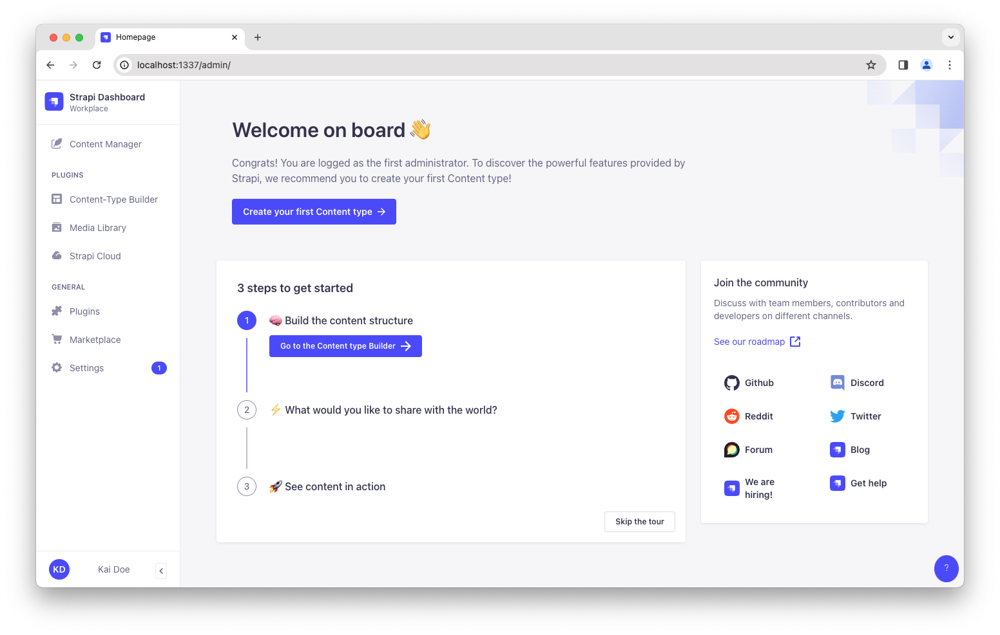
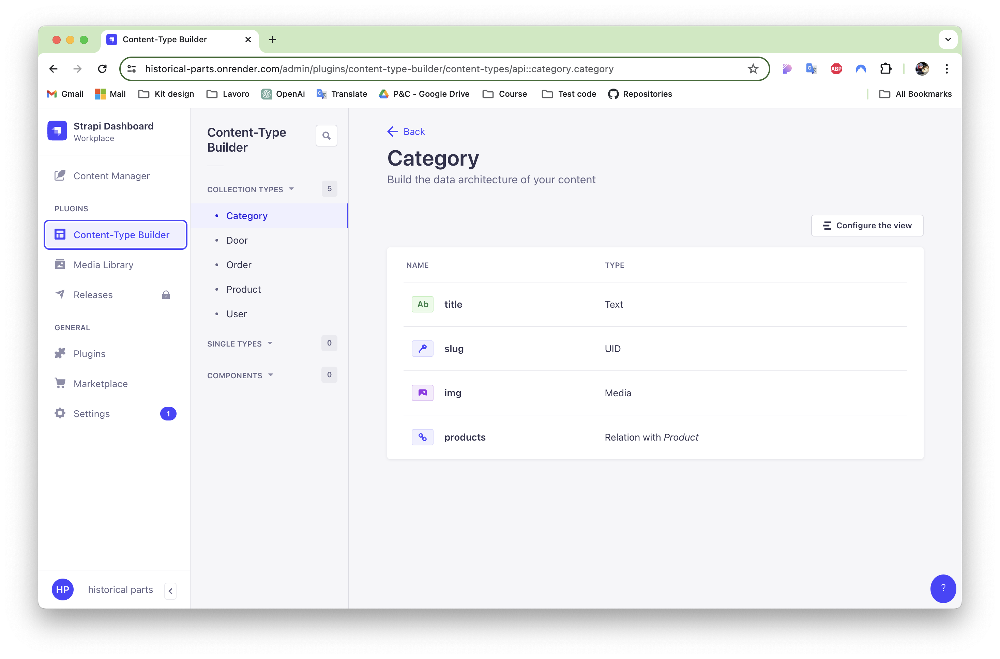

import { FileTree, Steps, Callout} from 'nextra/components'

# INTRO
We have integrated Strapi into our project.  
This is a popular open-source content management system (CMS) that allows us to rapidly create APIs through a user-friendly interface. It is based on Node.js and offers extensive flexibility as it can be customized to fit any SQL or NoSQL database.

### What we wse Strapi for

**1. Rapid and Flexible API Development:** Strapi enables us to quickly build REST or GraphQL APIs. We can easily create custom endpoints, configure data relationships, and manage content types with ease.

**2. Headless CMS:** As a headless CMS, Strapi focuses solely on content management and delivery via APIs, making it ideal for integration with any front end, from static websites to mobile apps or IoT services.

**3. Content Management:** Strapi provides a robust admin panel that allows our non-technical team members to easily manage content. This includes functionalities such as creating, updating, and deleting content, as well as managing users and customizing permissions.

**4. Plugins and Customization:** Strapi supports a wide range of plugins that extend its functionality, such as authentication, email, and file management. We also have the capability to write our own plugins to meet specific needs.

**5. Community and Support:** Being open source, Strapi has an active community of developers and users who constantly contribute new features, bug fixes, and support through forums and group chats.

We appreciate Strapi for its extensibility and scalability, making it a popular choice among developers looking for a modern CMS solution that can evolve as the needs of our project grow.

## How we install it

<Steps>
### Part A: Create a new project with Strapi
#### 
We will first create a new Strapi project on our machine by running a command in the terminal, and then register our first local administrator user.
```tsx
npx create-strapi-app@latest my-project --quickstart
```
#### Register the first local administrator user
Once the installation is complete, our browser automatically opens a new tab.
By completing the form, we create our own account.

We now have access to the admin panel:




### Part B: Build your data structure with the Content-type Builder
First we will build a data structure for the content. 
The Content-Type Builder helps us create our data structure.


#### Create a collection type
 We need to create a collection type. 
 Then we can describe the fields to display when adding a new product:

- Click on the Create your first Content type button.
- If it's not showing up, go to Content-type Builder icon Content-type Builder in the main navigation.
- Click on Create new collection type.
- Click the Text field.
- Type Name in the Name field.
- Switch to the Advanced Settings tab, and check the Required field and the Unique field settings.
- Click on Add another field.
- Choose the Rich text (Blocks) field in the list.
- Type Description under the Name field, then click Finish.
- Finally, click Save and wait for Strapi to restart.




</Steps>

