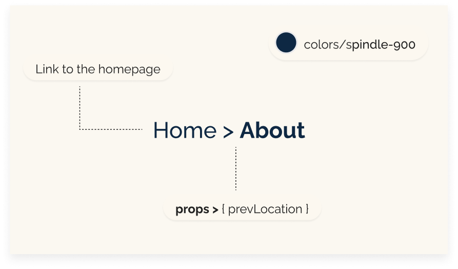

# Breadcrumbs

We have integrated the Breadcrumbs component into our application to enhance user navigation. This component plays a crucial role by providing users with links back to previous pages or the home page, depending on their navigation path. It helps users understand their current location within the application and navigate effectively.  
We have carefully crafted this component to ensure it is reusable and adaptable across various parts of our application. It allows for a consistent and intuitive navigation experience, helping our users understand their location and how to return to previously visited pages.




## Structure
Our Breadcrumbs component is structured to dynamically display navigation paths based on user interaction. Here's how we've set it up:
- **useState:** We initialize a state variable locationPath to store a segment of the current URL path.
- **useEffect**, useState from `"react"`: We use these hooks to manage the component's state and to handle side effects.
- **HiOutlineChevronRight** from `"react-icons/hi"`: This icon serves as a visual separator between elements of the breadcrumb trail.
- **useLocation** from `"react-router-dom"`: This hook allows us to access the current location object which reflects where the application is at any given time.

### Logic
- **Conditional Rendering:** If prevLocation is an empty string, we render a link to the home page. Otherwise, we display prevLocation as a navigable link.
- **Icons:** We use the HiOutlineChevronRight icon as a delimiter between the segments of the breadcrumb trail.
- **Current Path Display:** The locationPath, extracted from the URL, is displayed and capitalized to enhance readability.

## Props
**prevLocation:** This prop is crucial for our component. It can either be an empty string or a specific path, influencing the content displayed as the previous link in our breadcrumb trail. This flexibility allows the Breadcrumbs component to adapt to different parts of our application, providing appropriate navigation links based on user interaction.


```javascript
import { useEffect, useState } from "react";
import { HiOutlineChevronRight } from "react-icons/hi";
import { useLocation } from "react-router-dom";

const Breadcrumbs = ({ prevLocation }) => {
  const location = useLocation();
  const [locationPath, setLocationPath] = useState("");
  useEffect(() => {
    setLocationPath(location.pathname.split("/")[1]);
  }, [location]);

  return (
    <div className="w-full py-10 sm:py-10 flex gap-3">
      <p className="text-sm font-normal text-spindle-900 capitalize flex items-center">
        <span>
          {" "}
          {prevLocation === "" ? (
            <a className=" hover:font-bold" href="/">
              Home
            </a>
          ) : (
            prevLocation
          )}
        </span>
        <span className="px-1">
          <HiOutlineChevronRight />
        </span>
        <span className="capitalize font-semibold">{locationPath}</span>
      </p>
    </div>
  );
};
export default Breadcrumbs;
```