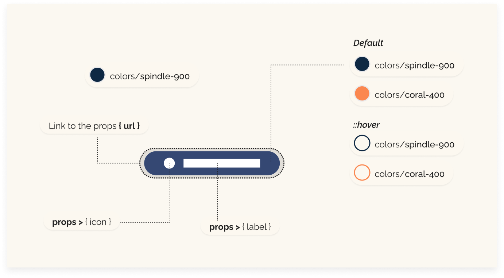

# Buttons
As part of our project's UI library, we have developed a Button component that serves as a versatile element across various user interfaces. This component is designed to be flexible, accommodating different styles and functionalities based on the props provided. Its ease of use and adaptability make it a critical component in our design system.
This component is integral to our application because it handles user interactions that involve moving between pages and executing actions. Its reusable design allows us to maintain a uniform look and feel across all buttons while accommodating specific functional requirements through props.



## Structure
Our Button component is structured to dynamically display navigation paths based on user interaction. Here's how we've set it up:
- **React** from `"react"`: Ensures the use of React framework functionalities.
- **Link** from `"react-router-dom"`: Provides routing capabilities that enable the button to navigate to different routes within the application.

## Props
Props
Our Button component accepts several props that determine its appearance and behavior:
- **label:** This prop represents the text to be displayed on the button. It is essential for accessibility and user interaction.
- **primary:** A boolean that determines the styling of the button. If true, the button uses the spindle-900 color theme, otherwise, it uses the coral-400 theme.
- **icon:** This optional prop allows the inclusion of an icon next to the button text, enhancing the visual appeal and providing additional context.
- **url:** The navigation link for the button. This prop specifies the route to which the button should redirect the user when clicked.

## Styling and Functionality
The Button component is styled using TailwindCSS for rapid development and consistency. It utilizes conditional rendering within the `className` attribute to apply different styles based on the `primary` prop:

- Primary Style: Applies bg-spindle-900 with hover effects that invert the text and background colors.
- Secondary Style: Uses bg-coral-400 and modifies hover behavior similarly.
- The button's design ensures it is fully adaptable for various parts of the application, whether it needs to stand out as a primary action or blend in as a secondary option.

## Rendering Logic
The component renders a `Link` that acts as a button, allowing for navigation defined by the `url` prop. The button can optionally display an icon alongside the label text, which is controlled by the `icon` prop. The combination of text and icon enhances user interaction by making the button's purpose clear and visually distinct.

```javascript
import { Link } from "react-router-dom";

const Button = ({ label, primary, icon, url }) => {
  return (
    <Link
      className={`block ${primary ? "bg-spindle-900 hover:text-spindle-900 border-spindle-900" : " bg-coral-400 hover:bg-none hover:text-coral-400 border-coral-400"} cursor-pointer  text-light-200 hover:bg-light-200  rounded-full w-full text-base px-4 py-1 mb-3 flex items-center justify-center border-[1px]`}
      to={url}
    >
      {icon && <span className=" inline-flex items-center mr-2">{icon}</span>}
      {label}
    </Link>
  );
};

export default Button;

```