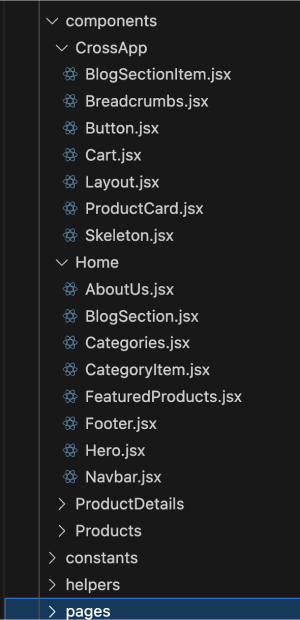

# The components

In UI and front-end development, components are reusable and self-contained blocks of code that encapsulate specific elements or functionality, such as buttons, forms, or sliders. They promote efficiency and consistency across a website or application by allowing developers to create a uniform look and feel while minimizing code duplication. Using components also simplifies maintenance and scalability, as changes made to a single component are propagated wherever it is used, making the development process more streamlined and manageable.

