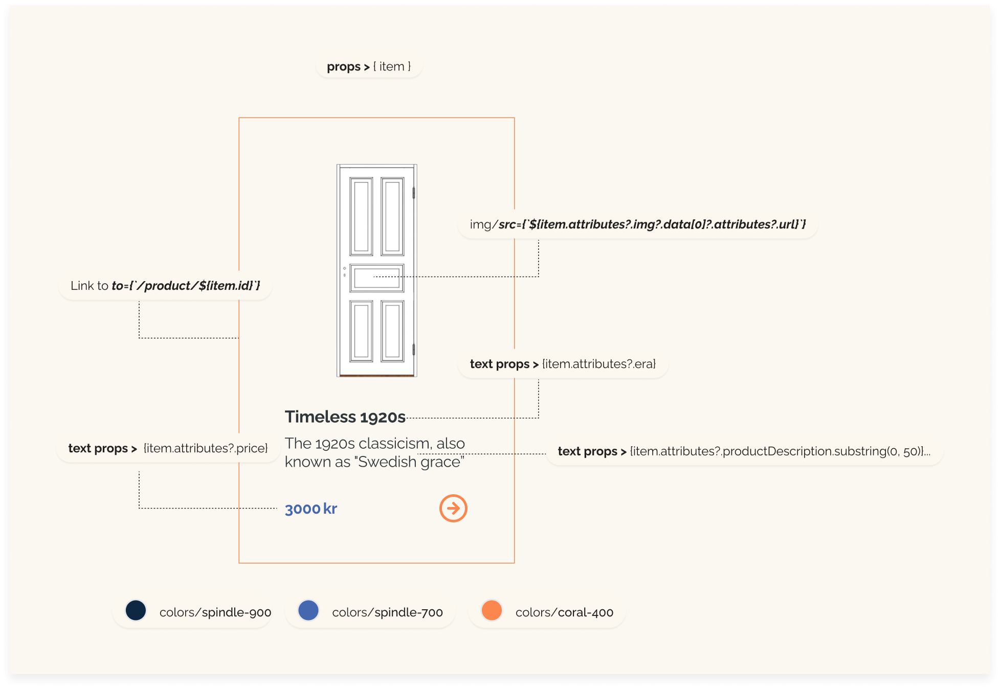

# Product Card
The ProductCard component is a critical part of our application's user interface, designed to display key information about products in a concise and visually appealing layout. This component is utilized across various parts of our application where product listings are required, providing a consistent and engaging user experience.




## Structure
- **Link** from `"react-router-dom"`: Facilitates navigation to individual product details pages by wrapping the card in a link that directs to the product's specific URL

## Props
The component accepts a single prop:

- **item:** An object containing all the necessary details about a product that needs to be displayed within the card.

## Styling and Functionality
This component is designed to showcase products in a card format, which includes:
- **Product Image:** Displays the primary image and a vector image that toggles on hover.
- **Product Details:**: Shows the product's era and a brief description cut off after 50 characters to maintain a clean layout.
- **Price Information:**: Displays the product's price.

The ProductCard is styled to be visually appealing and functional:
- Dimensions and Padding: Fixed width and padding ensure that all cards have a uniform appearance.
- Borders and Background: Uses a subtle border and a light background color to enhance readability and focus on the content.
- Hover Effects: Includes hover effects on the images to add interactivity and visual feedback.

## Rendering Logic
- **Link Wrapper:** The entire card is clickable, leading the user to a detailed page of the product using dynamic routing based on the product’s id.
- **Image Display:** The product images use CSS styles for a hover effect, where the main image fades in on hover and the vector image fades out.
- **Information Layout:** Product information is laid out using Flexbox, ensuring the text and price are well-organized.


```javascript
import { Link } from "react-router-dom";

const ProductCard = ({ item }) => {
  return (
    <Link className="" to={`/product/${item.id}`}>
      <div className="card w-72 bg-spindle-50 flex flex-col gap-2.5 p-8 border-[1px] border-coral-400">
        <div className="image w-full h-[250px] overflow-hidden relative">
          
          
        </div>
        <div className=" flex-1">
          <p className=" font-bold"> {item.attributes?.era}</p>
          <p className=" text-wrap text-sm">
            {item.attributes?.productDescription.substring(0, 50)}...
          </p>
        </div>
        <p className=" font-medium"> {item.attributes?.price} kr</p>
      </div>
    </Link>
  );
};
export default ProductCard;
```