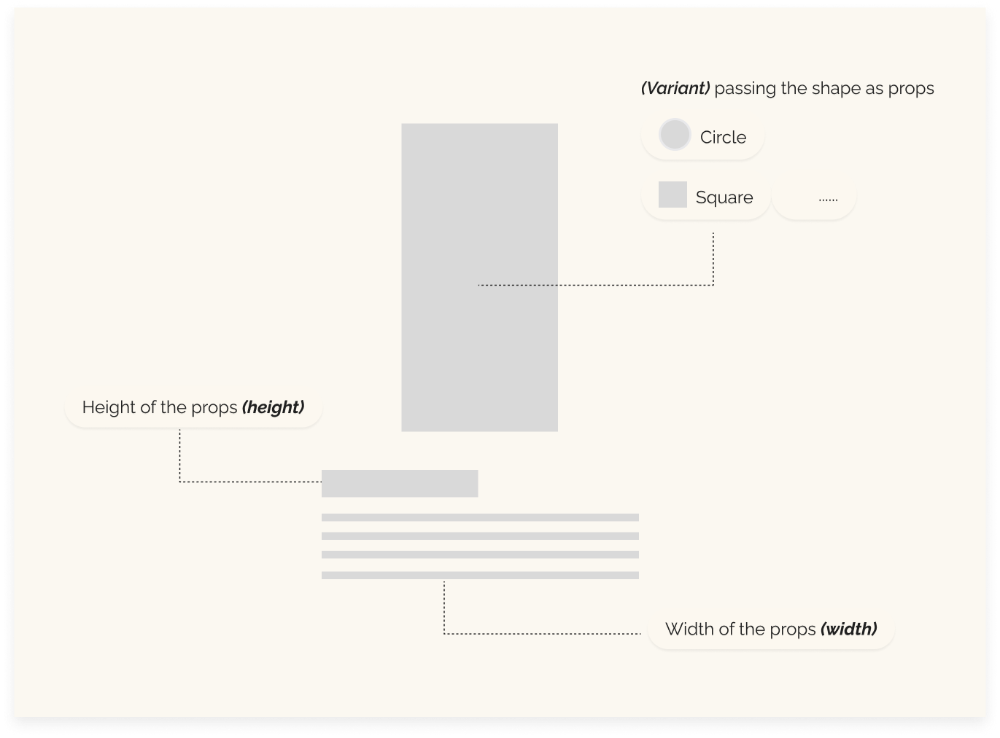

# Skeleton
The Skeleton component in React is a common solution for enhancing user experience during asynchronous data loading, particularly used in interfaces where content takes time to fully load. The core concept behind the Skeleton is to provide a temporary visual placeholder for the space that will be occupied by the loaded data, reducing visual disorientation and perceived performance improvements.



## Structure
The Skeleton component is highly configurable through props that define its appearance:

- **width:** The width of the skeleton component, which can be specified in pixels or as a percentage.
- **height:** The height of the skeleton component, also definable in pixels or percentage.
- **variant:** A CSS class that can be used to vary the appearance of the skeleton component, for example, to change the color or to include animations like a shimmering effect.

## Styling and Functionality
The Skeleton is typically used in scenarios of asynchronous data loading such as fetching data from a server. When data is pending load, the Skeleton is displayed, creating an illusion of content being loaded which can help keep the user engaged and reduce the perception of slowness. For instance, on a product page, instead of product images and descriptions, placeholder bars and boxes that represent the position and size of the content that will be loaded might be shown.  
The styling of the Skeleton component can be customized with CSS to fit the design of the rest of the application. Developers can add animations like a shimmering effect that simulates movement as the data is loading, increasing visual engagement and providing immediate feedback to the user that the system is active and functioning.


## Rendering Logic


```javascript
const Skeleton = ({ width, height, variant }) => {
  const style = {
    width,
    height,
  };
  return <span className={`skeleton ${variant}`} style={style}></span>;
};

export default Skeleton;
```