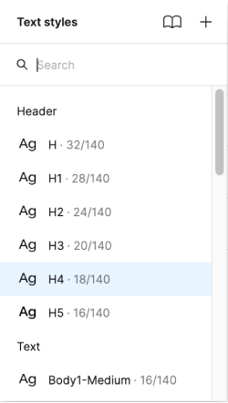
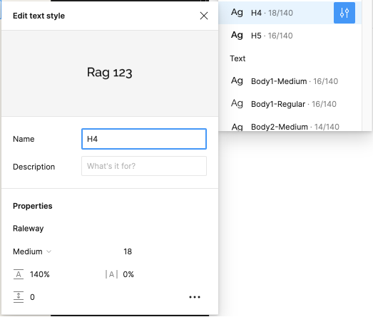

import { Callout } from 'nextra/components'

# Typography Mapping
General design guideline:
Based on the 50’s Funkis architecture style, we’ll make simplistic elements mainly with sharp edges, straight lines, along with a low-profile playfulness expressed by round elements.

| Style Name     | Font-Family | Font Weight | Font Size | Line Height | Letter Spacing | Paragraph Spacing |
|----------------|-------------|-------------|-----------|-------------|----------------|-------------------|
| H1             | Raleway     | Semi Bold   | 72 pt     | 120%        | 1%             | 0                 |
| H2             | Raleway     | Bold        | 56 pt     | 120%        | 1%             | 0                 |
| H3             | Raleway     | Bold        | 48 pt     | 120%        | 1%             | 0                 |
| H4             | Raleway     | Bold        | 40 pt     | 120%        | 1%             | 0                 |
| H5             | Raleway     | Bold        | 32 pt     | 120%        | 1%             | 0                 |
| H6             | Raleway     | Bold        | 24 pt     | 120%        | 1%             | 0                 |
| H7             | Raleway     | Bold        | 18 pt     | 120%        | 1%             | 0                 |
| Body1/Bold     | Raleway     | Bold        | 24 pt     | 120%        | -1%            | 16                |
| Body1/Regular  | Raleway     | Regular     | 24 pt     | 120%        | -1%            | 16                |
| Body2/Bold     | Raleway     | Bold        | 22 pt     | 120%        | -1%            | 16                |
| Body2/Regular  | Raleway     | Regular     | 22 pt     | 120%        | -1%            | 16                |
| Body3/Bold     | Raleway     | Bold        | 20 pt     | 120%        | -1%            | 16                |
| Body3/Regular  | Raleway     | Regular     | 20 pt     | 120%        | -1%            | 16                |
| Body4/Bold     | Raleway     | Bold        | 18 pt     | 120%        | -1%            | 14                |
| Body4/Regular  | Raleway     | Regular     | 18 pt     | 120%        | -1%            | 14                |
| Body5/Bold     | Raleway     | Bold        | 16 pt     | 120%        | -1%            | 14                |
| Body5/Regular  | Raleway     | Regular     | 16 pt     | 120%        | -1%            | 14                |
| Body6          | Raleway     | Regular     | 12 pt     | 120%        | 0 px           | 0%                |
| Button/Large   | Raleway     | Bold        | 18 pt     | 120%        | -1%            | 0                 |
| Button/Medium  | Raleway     | Bold        | 16 pt     | 120%        | -1%            | 0                 |
| Button/Small   | Raleway     | Bold        | 14 pt     | 120%        | -1%            | 0                 |

## How to change text styles
Styles allows you to define a set of properties that can be reused across your team's designs. This is super handy for things like colors, typography, and shadows.  
Making changes to these styles or the typeface you’d like to use the project is easy. Here are the steps:



### Open the text style edit menu
Open the edit dialog by clicking on the edit style icon next to the style:



From here, you can change any of the text style properties — typeface, font size, line height — and these changes you make here will cascade down to every component and design the type scale is being used.

<Callout emoji="💡">
If you’re changing the typeface for your particular project, it’s a good idea to change all text styles at once, rather than just changing them as you’re using them. This will keep everything neat and tidy and will ensure you won’t miss any.
For larger projects, Figma can take a while to update some styles as they have to cascade down through every component they’re used in. It’s a bit of a pain, but worth it when it’s complete!
</Callout>

## How we implement it in our code
To set our typography system, we changed directly under the `theme.colors` section of our configuration file (`tailwind.config.js
):

```javascript
/** @type {import('tailwindcss').Config} */
export default {
  content: ["./index.html", "./src/**/*.{js,ts,jsx,tsx}"],
  theme: {
    theme: {},
    extend: {
      fontFamily: {
        raleway: ["Raleway", "sans-serif"],
      },
      fontSize: {
        "5xl": [
          "2rem",
          {
            lineHeight: "2em",
            fontWeight: "700",
          },
        ],
        "4xl": [
          "2rem",
          {
            lineHeight: "2em",
            fontWeight: "700",
          },
        ],
        "3xl": [
          "1.75rem",
          {
            lineHeight: "2em",
            fontWeight: "700",
          },
        ],
        "2xl": [
          "1.5rem",
          {
            lineHeight: "1.75em",
            fontWeight: "700",
          },
        ],
        xl: [
          "1.35rem",
          {
            lineHeight: "1.75em",
            fontWeight: "600",
          },
        ],
        lg: [
          "1.15rem",
          {
            lineHeight: "1.75em",
            fontWeight: "600",
          },
        ],
        base: [
          ".8rem",
          {
            lineHeight: "1.5em",
            fontWeight: "400",
          },
        ],
        sm: [
          ".7rem",
          {
            lineHeight: "1.25em",
            fontWeight: "400",
          },
        ],
        xs: [
          ".5rem",
          {
            lineHeight: ".8em",
            fontWeight: "400",
          },
        ],
      },
    },
  },
  plugins: [],
};
```