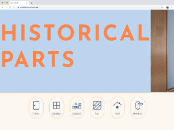

import { Callout } from 'nextra/components'

# Welcome to Historical parts

[Historical Parts](https://historical-parts.web.app) is an intermediary between architects, designers, individuals and construction companies. It offers a user-friendly digital platform and Progressive Web App (PWA) for scanning, viewing and purchasing reusable building components.

## Project Overview

The Historical Parts platform aims to facilitate the access and use of reclaimed building materials. Through artificial intelligence, it efficiently connects architects, buyers, and sellers, enhancing the discovery and integration of reusable building components.

### Values and Mission
Promoting sustainability in the construction sector is at the core of Historical Parts' mission. The company is committed to reducing waste, supporting the conservation of architectural heritage, and enabling the incorporation of these materials into new and existing construction projects. Recognizing the intrinsic value of historical materials, the company dedicates itself not only to environmental sustainability but also to the aesthetic and cultural enrichment of built environments.

### Potential users - what we have found so far
<Callout emoji="🥨">
Potential Sellers - Construction companies - small/large, Private customers, Property owners
</Callout>
<Callout type="warning" emoji="🍔">
Potential Buyers - Architects , Construction companies - small/large, Interior designers
Property owners and Private customers.
</Callout>
